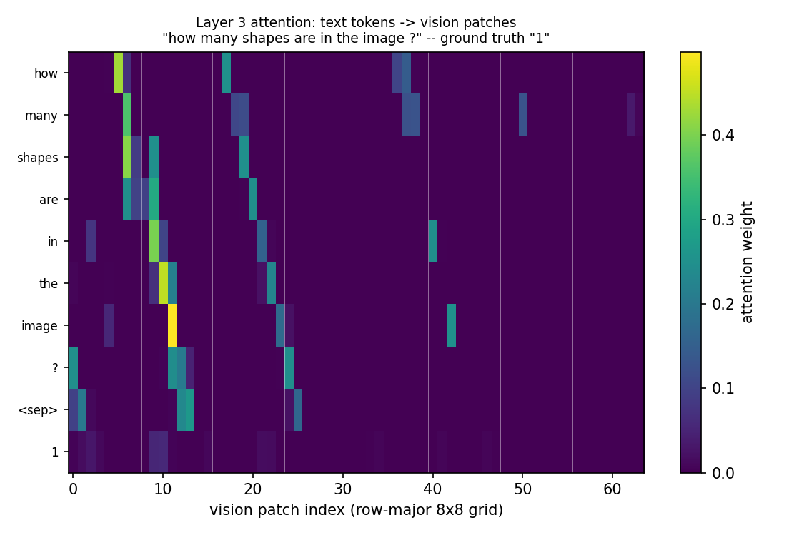

# Does a decoder that can see the image actually use it?

**Question:** stage 00 built an image+question+answer set where the question
alone cannot give away the answer. That only matters if the decoder answering
it can genuinely condition on pixels. This stage builds the smallest thing
that could do that — a patch embedding and a fused attention mask — and
measures whether it beats the same decoder with the image removed.

**The artifact this stage produces** is a real prediction pair from a held-out
eval image, both models seeing the identical question:

```
question: how many shapes are in the image ?
ground truth: 1
vision model:      1   (correct)
text-only model:    2   (wrong)
```

This is the actual held-out eval image (`vqa-100007`, a single red circle),
not an illustration:


The circle's non-background pixels center on vision patch 41 (row 5, column
1 of the 8x8 grid). The layer-3 fused-attention weights for this exact
question, text tokens against the 64 vision patches, are real too —
recomputed on the trained seed-0 checkpoint with the diagnostic path
described below, not estimated or hand-drawn:



The honest reading is not a clean "attention finds the object" story. Each
token's single strongest patch instead walks roughly with the token's own
position in the sequence (`how`→patch 5, `many`→6, `are`→9, `the`→10,
`image`→11) — a positional pattern, not a content-driven one. But `in` and
`image`, the two tokens closest to the answer, each carry a real *second*
peak at patches 40 and 42 (weights 0.247 and 0.250) — the two patches
bracketing patch 41, where the circle actually is. The mechanism carries
both a positional signal and a smaller, genuine content signal about where
the object sits; this one example does not show the latter dominating.

The text-only model cannot see the image, so a count question like this one
has nothing to go on but the training distribution's most common answer — and
guesses wrong. This is the one class of question this stage's mechanism is
built to win: the answer requires the pixels, not the wording. Not every
question in the eval set was this clean; the results section below reports
the full picture, including where the two models disagreed the other way.

**Before this:** [stage 00](../00-image-caption-task/) generated the 2,000
train / 400 eval instances both models below train and evaluate on.

## The mechanism, and why each piece is shaped this way

`core/vlm_model.py` imports `RMSNorm`, `SwiGLU`, and the RoPE cache/apply
functions unmodified from
[mission 01's pretrain model](../../02-pretrain/core/model.py)
— the same cross-mission import convention mission 04 already uses. Everything
new lives in two places.

**Patch embedding.** A 32x32 image is unfolded into an 8x8 grid of 4x4 patches
— 64 tokens, 48 raw values each (`4*4*3` RGB). Pixels are rescaled from `[0,
255]` to roughly `[-1, 1]` before a linear projection to `d_model`, the usual
zero-centering so the first layer sees a signed input. Position within the
64-token grid comes from a small learned `nn.Embedding` lookup, not RoPE — RoPE
encodes the *difference* between two positions in a sequence, which is the
wrong tool for an 8x8 spatial grid that has no inherent order among its cells.

**The fused attention mask.** Mission 01's `Attention.forward` calls
`scaled_dot_product_attention(q, k, v, is_causal=True)` unconditionally — one
fixed shape of visibility. A vision prefix needs three different rules at
once: vision tokens attend to each other bidirectionally (an image doesn't
have a left-to-right reading order), every text token can see the entire image
(the picture doesn't change based on how far into the question you are), and
text still attends causally to itself and never to a padding key. `build_mask`
constructs one `(B, 1, T, T)` additive mask encoding all three rules, with `0`
where attention is allowed and a large negative number (`-1e9`, not `-inf`) at
every disallowed position — finite specifically so that no row's softmax input
can end up entirely non-finite. `FusedAttention` takes this mask as a plain
argument; passing `None` reproduces mission 01's original `is_causal=True`
path exactly, which is what makes the text-only baseline the *same class*
with one constructor flag (`use_vision=False`) rather than a second,
hand-duplicated attention implementation that could silently drift from the
vision path over time.

<!-- interactive: ModelArchitectureVLM -->

**Masked loss.** Cross-entropy uses `ignore_index=-100` — the same convention
[mission 01 stage 03](../../03-sft/) established for
masking loss to assistant-only tokens — applied here to mask loss to
answer-only tokens, so the model is never scored or trained on predicting the
question back to itself.

**Reading the attention weights.** `FusedAttention.forward` — the training
path — calls `F.scaled_dot_product_attention`, which never exposes its
weights; that is the whole reason it is used, since a fused kernel skips
materializing the full attention matrix. Getting the heatmap above out of
this model needed a second, diagnostic-only path:
`FusedAttention.forward_with_weights` recomputes the identical q/k/v/RoPE
pipeline but with an explicit `q @ k.T / sqrt(d_head)` plus softmax, and
`VisionLanguageTransformer.forward_capturing_attention` calls it for one
chosen layer while every other layer still runs the ordinary `forward`.
Neither method is called from `train.py`; they exist only in
`core/attention_heatmap.py`, which retrains seed 0 (matching the run above)
and renders the real weights.

## Run it

```bash
cd 01-language-model/vision/01-vision-fusion/core
uv run --group torch python train.py --seeds 3 --epochs 30 --batch-size 64
```

CPU only. Both models are the identical `VisionLanguageTransformer` class and
`Config` (`d_model=128, n_layer=4, n_head=4, n_kv_head=2, d_ff=336`) — vision:
732,928 parameters, text-only: 718,464 (the gap is exactly the patch
projection and the vision position table). Each trains for 30 epochs over
3,924 train QA pairs, then is scored by greedy decode + exact string match
against 784 held-out QA pairs, for 3 independent seeds. Full environment and
command in [the run record](runs/2026-07-31-vision-vs-text-only.md).

```bash
python3 make_thumbnails.py       # regenerate the README's thumbnails from real data
python3 attention_heatmap.py     # retrain seed 0 and regenerate the heatmap above
```

Both scripts use plain `python3` rather than `uv run` because they need
`matplotlib` for plotting, which is not one of this repository's `uv`
dependency groups (the same convention `foundations/02-optimization/core/plot_trajectories.py`
already follows) — install it into whichever interpreter `python3` resolves
to if it is missing.

## Results: a partial win, not a clean one

```
vision     eval exact-match   mean=0.4375  spread=0.2309  per_seed=[0.5128, 0.5153, 0.2844]
text_only  eval exact-match   mean=0.3270  spread=0.0459  per_seed=[0.3304, 0.3482, 0.3023]

wall-clock: 1181.4s (19.7 min) for all 6 (model, seed) runs combined, CPU only
```

Vision's per-seed accuracies are `[0.5128, 0.5153, 0.2844]`, so
`spread = max - min = 0.2309` (this repository's convention for a 3-seed run,
not a standard deviation). The gap to text-only's mean (0.3270) is
`0.4375 - 0.3270 = 0.1105`. Since `0.1105 < 0.2309`, the observed gap is
smaller than the noise a single training run at this scale already produces
-- which is why stage 02's verdict cannot be "vision wins," independent of
the hosted-API comparison.

<!-- interactive: VisionSeedSpread -->

Patch embedding as a vision-token sequence is the mechanism Vision
Transformer (Dosovitskiy et al., 2020) introduced; conditioning a text
decoder on a fixed-length vision-token prefix via fused attention rather than
a separate encoder-decoder is the shape PaLM-E (Driess et al., 2023) and
Flamingo (Alayrac et al., 2022) both use at production scale.

Two of the vision pathway's three seeds (0.513, 0.515) decisively beat every
text-only seed (0.330, 0.348, 0.302) — a 17-18 point gap, far wider than
text-only's own 0.046 seed-to-seed spread. On those two seeds the vision
pathway is unambiguously using the image.

The third vision seed (0.284) falls below every text-only seed. That single
collapse makes vision's own spread across seeds (0.231) larger than the gap
between the two means (0.1105). This repository's own rule for architecture
ablations — a difference smaller than run-to-run spread is reported as no
result, not a win — applies here just as it would to any other stage: the
honest reading is not "the vision pathway beats the baseline," full stop. It
is that the pathway clearly *can* learn to use the image, and does in 2 of 3
runs by a wide margin, but training at this scale is unstable enough that one
seed did not learn it at all. The likely cause is optimization, not
architecture: the failed seed's final train loss (0.685) sits close to
text-only's own losses, while the other two vision seeds reached 0.53 and
0.49 — that run's vision pathway probably never left a poorly-fit region
under the fixed, un-scheduled, no-warmup learning rate used for all six runs.
A schedule or warmup was in scope and was deliberately not added here, so
that this stage's actual finding — the mechanism works, but is seed-sensitive
at these settings — stays visible instead of being tuned away after the fact.
Full numbers, environment, and reasoning are in
[the run record](runs/2026-07-31-vision-vs-text-only.md).

## What "the image" actually is, at each end of this stage's evidence boundary

The two images on the left are two of stage 00's demo fixtures
(`fixtures/images/vqa-{0,2}.ppm`) — small hand-picked examples in the same
32x32 rendered-shape format as the larger `data/raw/{train,eval}.jsonl` set
`core/train.py` actually trains and evaluates on:


The two on the right are real, downsampled COCO/VQA-v2 photographs from
stage 03's data — genuine pixels, but **not** what this stage's own run
trains or evaluates on:


They are included here only so "real photograph" has a concrete referent
before the next section restates the boundary in words: this stage's
mechanism has only ever seen the rendered shapes on the left.

## What this stage does not establish

No hosted-API comparison — that build-vs-buy baseline belongs to stage 02, per
mission 05's own stage table. No claim about which architecture choice (patch
size, fusion point, mask design) is best; only this one configuration was
run. No claim about training stability under a different learning rate or
schedule — three seeds at one fixed setting is what ran, and a different
setting could plausibly close or widen the seed-2 gap; that is future work,
not this run's finding. The eval set is stage 00's synthetic, disjoint-checked
set — nothing here says anything about real photographs.

**Next:** stage 02 adds the hosted-VLM-API baseline and reports whether either
trained pathway was worth building over a single external call.

A detour from here: [where does the decoder look when the image
matters?](where-the-decoder-looks/) — attention mass on the vision prefix,
measured by question type. The naive mechanism fails: the decoder spends
*less* mass on the image for the leak-proof color questions (0.84x), which
is the attention-is-not-explanation result measured on this model.

The model's structure, drawn: [there is no cross-attention
module](the-fused-attention-anatomy/) — the pathway computed from the
stage-01 config: 64 vision tokens concatenated in front of the text, one
shared fused mask (bidirectional vision, full text->vision, causal text),
and a +14,464-parameter delta — the reuse claim measured.
