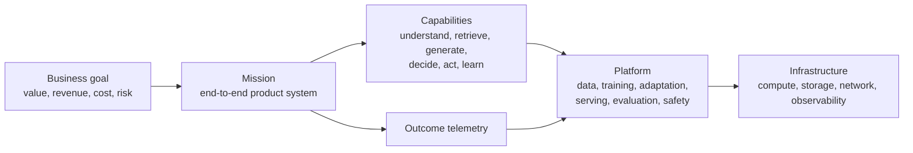

<p align="center"></p>

<h1 align="center">agi-playground</h1>

<p align="center"><strong>Build AI systems from infrastructure to measurable outcomes.</strong></p>

<p align="center">
  <strong><a href="https://rehearse.maestro.onl/playground">Read the tutorials online →</a></strong><br/>
  <sub>diagrams, rendered mathematics, and interactive demos — including a live tokenizer running the vocabulary trained here</sub>
</p>

<p align="center">
  <a href="https://github.com/kleon1024/agi-playground/actions"></a>
  <a href="LICENSE"></a>
  
</p>

Most AI curricula teach how a model is made. That is a pipeline —
`data → pretrain → post-train → RL → inference → agent` — and it explains one
artifact well. It cannot express who a system serves, what decision it makes on
their behalf, or whether it worked, which is why it has no natural place for
recommendation, ranking, realtime voice, generative media, or embodied agents.
Those are not more model types. They are different decision loops.

This repo teaches the durable skill instead: **given a problem, identify the
decision loop, choose the AI capabilities that serve it, build the system, and
prove the outcome.**

## The layers



A **capability** proves a hammer works. A **topic** — a mission, kept as a
directory and a contract — proves a problem got solved. That difference is the
point of the repo.

## The two invariants

> **Every capability claim is backed by a run.**
> **Every topic is backed by a measurable outcome.**

Technical numbers trace to a `runs/` entry naming the command, hardware,
wall-clock and cost. Outcome claims trace to a declared baseline, an outcome,
and guardrails.

Because business outcomes cannot be executed on a GPU — this repo has no live
users — topics prove them against **declared, reproducible proxies** (offline
replay, simulated users, public benchmark against a stated baseline), and every
topic must state what it does *not* establish. One fabricated number would cost
more credibility than every verified one earns. See
[`reference/`](reference/), specifically [`standards/`](reference/standards/).

## Topics

| Topic | Decision loop | Status |
|---|---|---|
| [01 · language-model system](01-language-model/) | Raw text → tokenizer → pretrain → adapt → serve → act, on one 24GB GPU — vision as a sub-path | In progress — [contract](01-language-model/mission.yaml) |
| [02 · personalized discovery](02-personalized-discovery/) | Recommendation, search, and ads as one decision loop: intent → retrieve → rank → allocate → feedback | Contract written — [contract](02-personalized-discovery/mission.yaml) |
| [03 · quantitative research](03-quantitative-research/) | Point-in-time data → signal → portfolio → validation → capacity, where the adversary is your own search | Contract written — [contract](03-quantitative-research/mission.yaml) |
| [04 · agentic platform](04-agentic-platform/) | What makes an agent's "fixed" true: harness, failure taxonomy, cost per correct patch | Contract written — [contract](04-agentic-platform/mission.yaml) |
| [05 · game AI](05-game-ai/) | Does RL against a verifiable game reward beat a fixed baseline, and at what cost? | [contract](05-game-ai/mission.yaml) |
| [07 · multimodal generation](07-multimodal-generation/) | Voice and video as one topic: codec and video-token mechanisms, generation models, and the codebook failures both surfaces share | [contract](07-multimodal-generation/mission.yaml) |
| [08 · bio-pharma modeling](08-bio-pharma-modeling/) | Can a small from-scratch model beat a descriptor baseline on a real toxicity endpoint? | [contract](08-bio-pharma-modeling/mission.yaml) |
| [09 · autonomous driving](09-autonomous-driving/) | Does a policy that only imitated an expert in a simulator still drive in the loop? | [contract](09-autonomous-driving/mission.yaml) |

Topic 01 is the first vertical slice. Its job is to prove the platform layers
compose at all, and its contract says plainly that it beats no business
baseline — a hosted frontier model will outperform its output on nearly every
task.

Topic 02 is the test of the architecture itself. Ranking is a genuinely
different decision loop — different objective, different failure modes, no text
output — so if the platform layers are real rather than a relabelled LLM
pipeline, it should reuse them. It is also the first topic with a business
outcome, and therefore the first bound by the full outcome-proof discipline:
offline replay, two baselines including un-personalized popularity, guardrails
on coverage and diversity, and an explicit statement that no claim about live
user behaviour is supported.

Topic 03 exists to attack a different failure mode. In topics 01 and 02 a bad
model produces visibly bad output; in quantitative research a bad model
produces a beautiful backtest, because the search that found it is the same
process that overfits it. The topic is therefore built around making that
search auditable — a machine-written log of every variant tried, purged and
embargoed validation folds, and a deflated Sharpe ratio treated as a guardrail
rather than a score.

Topics are added deliberately. Topic 01 finishes before topic 02 starts.

## Repository

Nine topics plus two support libraries, and one sentence each is enough to
place any chapter:

| Directory | What it owns |
|---|---|
| [`01-language-model/`](01-language-model/) | raw text → tokenizer → pretrain → adapt → serve → act, with vision under it |
| [`02-personalized-discovery/`](02-personalized-discovery/) | recommendation, search, and ads: a shared core plus per-surface stages |
| [`03-quantitative-research/`](03-quantitative-research/) | point-in-time data → signal → portfolio → validation → capacity |
| [`04-agentic-platform/`](04-agentic-platform/) | the agent harness, its failure modes, and the cost of a correct patch |
| [`05-game-ai/`](05-game-ai/) · [`07-multimodal-generation/`](07-multimodal-generation/) · [`08-bio-pharma-modeling/`](08-bio-pharma-modeling/) · [`09-autonomous-driving/`](09-autonomous-driving/) | the remaining decision loops |
| [`foundations/`](foundations/) | mechanism that holds regardless of which topic you run |
| [`reference/`](reference/) | contracts, governance, compute-lane guides, and dated survey material with no run |

There is no `missions/`, no `platform/`, and no `capabilities/`. The
`missions/` level was removed and its contents pulled up one level. `platform/`
and `capabilities/` were each a second telling of topic 01 over the same
lifecycle, sixteen of seventeen chapters serving exactly one topic while
navigation offered them as a parallel curriculum. The old `infra/` tree was
absorbed: networking, storage, orchestration, and GPU-cluster concepts now sit
under `foundations/04-distributed-training/`, observability and dedup sit
beside the serving and corpus stages that need them, and the compute-lane
guides live in `reference/`. A deep-dive now lives in the stage whose decision
it changes, and the cross-cutting view is an index — [read by
topic](https://rehearse.maestro.onl/playground/topics/) — rather than a
directory.

### foundations

| Lesson | Status |
|---|---|
| [The decoder block](foundations/00-attention/) — how one token finds the context it needs, and [what that block costs](foundations/00-attention/what-it-costs/) | Draft |
| [First training loop](foundations/01-first-training-loop/) — the smallest complete pretraining loop, and why its failure is a *data* failure | Verified |

### Chapters two topics share

There is no `capabilities/` directory. A chapter that a second topic needs
stays in the topic that built and measured it, and the second topic links to
it — because moving it would separate the explanation from the run that backs
it, and a chapter with no evidence beside it is exactly what this repo is
trying not to publish. The one chapter that has cleared the bar so far is
[topic 01's agent harness](01-language-model/06-agent/) — loop, tool schemas,
context policy, permission ladder — reused by [personalized discovery's rule
engine](02-personalized-discovery/shared/07-rule-engine/) and by [the agentic
platform](04-agentic-platform/) with the same inputs and the same objective,
different tools.

The bar itself is unchanged and recorded in
[the admission gate](reference/standards/mission-contract.md): two topics need
it independently, it has an I/O contract, it is objectively evaluable, it maps
toy → production, and it runs on an existing compute lane. Reuse of a noun is
not reuse of a decision — a rank in a recommendation slate and a rank in a
trading portfolio share a word, not a contract.

## How lessons work

```
<lesson>/
├── README.md   # intuition → mechanism → walkthrough → production notes → exercises
├── core/       # from-scratch: minimal dependencies, written to be read
├── prod/       # the same job with the real tool, config included
└── runs/       # command, hardware, wall-clock, cost, metrics
```

`core/` teaches mechanism, `prod/` teaches practice — both must run. The
pedagogy is **read the toy, then map to the real thing**: minbpe ↔ HF
tokenizers, nanoGPT ↔ torchtitan, TRL GRPO ↔ verl, nano-vLLM ↔ vLLM,
mini-swe-agent ↔ Claude Code, Trackio ↔ wandb.

A lesson without a `runs/` entry stays `status: draft` and shows as draft above.

## Hardware

Two lanes, documented as content in [`reference/`](reference/), both verified
with recorded output:

- **Local** — a 24GB card reached over Tailscale SSH into WSL2. Covers every
  `core/` implementation, GPT-2-class pretraining, ≤8B LoRA, GRPO on 0.5–3B,
  data pipelines, and all serving, harness, and eval work.
- **Cloud — Modal** — multi-GPU parallelism, 7B+ full-parameter work,
  GPU-scale dedup, rollout concurrency. Every Modal run prints its dollar cost.

## Research

[`reference/research/`](reference/research/) holds the landscape survey the
curriculum's scope is argued from — what exists, what it covers, and the gaps
this repo targets. Kept as a standing artifact and updated as the field moves.

## License

MIT.

---

<p align="center">Built by <a href="https://maestro.onl">Maestro</a> — Singapore AI product studio.</p>
