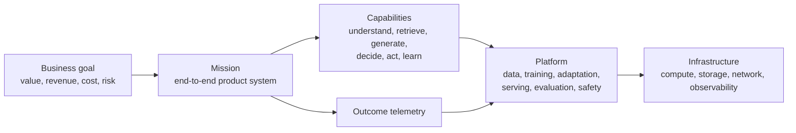

<p align="center"></p>

<h1 align="center">agi-playground</h1>

<p align="center"><strong>Build AI systems from infrastructure to measurable outcomes.</strong></p>

<p align="center">
  <strong><a href="https://rehearse.maestro.onl/playground">Read the tutorials online →</a></strong><br/>
  <sub>diagrams, rendered mathematics, and interactive demos — including a live tokenizer running the vocabulary trained here</sub>
</p>

<p align="center">
  <a href="https://github.com/kleon1024/agi-playground/actions"></a>
  <a href="LICENSE"></a>
  
</p>

Most AI curricula teach how a model is made. That is a pipeline —
`data → pretrain → post-train → RL → inference → agent` — and it explains one
artifact well. It cannot express who a system serves, what decision it makes on
their behalf, or whether it worked, which is why it has no natural place for
recommendation, ranking, realtime voice, generative media, or embodied agents.
Those are not more model types. They are different decision loops.

This repo teaches the durable skill instead: **given a problem, identify the
decision loop, choose the AI capabilities that serve it, build the system, and
prove the outcome.**

## The five layers



A **capability** proves a hammer works. A **mission** proves a problem got
solved. That difference is the point of the repo.

## The two invariants

> **Every capability claim is backed by a run.**
> **Every mission is backed by a measurable outcome.**

Technical numbers trace to a `runs/` entry naming the command, hardware,
wall-clock and cost. Outcome claims trace to a declared baseline, an outcome,
and guardrails.

Because business outcomes cannot be executed on a GPU — this repo has no live
users — missions prove them against **declared, reproducible proxies** (offline
replay, simulated users, public benchmark against a stated baseline), and every
mission must state what it does *not* establish. One fabricated number would
cost more credibility than every verified one earns. See
[`standards/`](standards/).

## Missions

| Mission | Decision loop | Status |
|---|---|---|
| [01 · language-model agent](missions/01-language-model-agent/) | Raw text → tokenizer → pretrain → adapt → serve → act, on one 24GB GPU | In progress — [contract](missions/01-language-model-agent/mission.yaml) |
| [02 · personalized discovery](missions/02-personalized-discovery/) | Recommendation, search, and ads as one decision loop: intent → retrieve → rank → allocate → feedback | Contract written — [contract](missions/02-personalized-discovery/mission.yaml) |
| [03 · quantitative research](missions/03-quantitative-research/) | Point-in-time data → signal → portfolio → validation → capacity, where the adversary is your own search | Contract written — [contract](missions/03-quantitative-research/mission.yaml) |

Mission 01 is the first vertical slice. Its job is to prove the platform layers
compose at all, and its contract says plainly that it beats no business
baseline — a hosted frontier model will outperform its output on nearly every
task.

Mission 02 is the test of the architecture itself. Ranking is a genuinely
different decision loop — different objective, different failure modes, no text
output — so if the platform layers are real rather than a relabelled LLM
pipeline, it should reuse them. It is also the first mission with a business
outcome, and therefore the first bound by the full outcome-proof discipline:
offline replay, two baselines including un-personalized popularity, guardrails
on coverage and diversity, and an explicit statement that no claim about live
user behaviour is supported.

Mission 03 exists to attack a different failure mode. In missions 01 and 02 a
bad model produces visibly bad output; in quantitative research a bad model
produces a beautiful backtest, because the search that found it is the same
process that overfits it. The mission is therefore built around making that
search auditable — a machine-written log of every variant tried, purged and
embargoed validation folds, and a deflated Sharpe ratio treated as a guardrail
rather than a score.

Missions are added deliberately. Mission 01 finishes before mission 02 starts.

## Repository

```
foundations/   mathematics and mechanism, bound to no product
platform/      the lifecycle that turns models into reliable capabilities
capabilities/  composable hammers, admitted only when two missions need them
missions/      infrastructure through to business outcome
infra/         local, cloud, and distributed runtime
research/      the landscape evidence behind every technical choice
standards/     the contracts lessons, capabilities, and missions must satisfy
```

### foundations

| Lesson | Status |
|---|---|
| [The decoder block](foundations/00-attention/) — how one token finds the context it needs, and [what that block costs](foundations/00-attention/what-it-costs/) | Draft |
| [First training loop](foundations/01-first-training-loop/) — the smallest complete pretraining loop, and why its failure is a *data* failure | Verified |

### platform

| Layer | Scope | Status |
|---|---|---|
| [data](platform/data/) | Pipelines, dedup, filtering, annotation, synthetic data | Seeded by [mission 01 · corpus](missions/01-language-model-agent/00-corpus/) |
| [training](platform/training/) | Tokenizers, architecture, training loop, scaling laws | Overview draft; 4 of 5 sub-lessons verified by runs |
| [adaptation · mid-training](platform/adaptation/mid-training/) | The stage between pretraining and SFT: agentic and tool-use priors at pretraining scale, long-context extension, observation masking | Draft |
| [adaptation · post-training](platform/adaptation/post-training/) | SFT, LoRA/PEFT, reward models, DPO family, merging | Draft |
| [adaptation · distillation](platform/adaptation/distillation/) | What you can copy from a better model, and what a measured gain is allowed to mean; [what path two requires](platform/adaptation/distillation/what-path-two-requires/) prices the storage and the tokenizer wall | Verified |
| [adaptation · RL](platform/adaptation/reinforcement-learning/) | PPO grounding → GRPO/GSPO/DAPO → RLVR → agentic RL | Draft |
| [serving](platform/serving/) | KV cache, paged attention, batching, speculative decoding, quantization; training infra | Overview draft; [graph execution](platform/serving/01-graph-execution/) verified by a run |
| [evaluation & observability](platform/evaluation-observability/) | Static and agentic evals, contamination, harness disclosure | Draft |
| [safety & governance](platform/safety-governance/) | Enforcing the guardrails missions declare | Draft |

### capabilities

| Capability | Scope | Status |
|---|---|---|
| [act-coordinate](capabilities/act-coordinate/) | Harness engineering: loop, tools, context management, sandboxing, sub-agents | Draft |

`capabilities/` holds exactly one entry on purpose. Perception, retrieval,
generation, ranking, and continual learning are named in the architecture
because the structure needs somewhere to put them — not because they are
half-built. A capability is admitted only when **two** missions need it, it has
an I/O contract, it is objectively evaluable, it maps toy → production, and it
runs on an existing compute lane. An empty folder is a promise; this repo
prefers to owe nothing.

## How lessons work

```
<lesson>/
├── README.md   # intuition → mechanism → walkthrough → production notes → exercises
├── core/       # from-scratch: minimal dependencies, written to be read
├── prod/       # the same job with the real tool, config included
└── runs/       # command, hardware, wall-clock, cost, metrics
```

`core/` teaches mechanism, `prod/` teaches practice — both must run. The
pedagogy is **read the toy, then map to the real thing**: minbpe ↔ HF
tokenizers, nanoGPT ↔ torchtitan, TRL GRPO ↔ verl, nano-vLLM ↔ vLLM,
mini-swe-agent ↔ Claude Code, Trackio ↔ wandb.

A lesson without a `runs/` entry stays `status: draft` and shows as draft above.

## Hardware

Two lanes, documented as content in [`infra/`](infra/), both verified with
recorded output:

- **Local** — a 24GB card reached over Tailscale SSH into WSL2. Covers every
  `core/` implementation, GPT-2-class pretraining, ≤8B LoRA, GRPO on 0.5–3B,
  data pipelines, and all serving, harness, and eval work.
- **Cloud — Modal** — multi-GPU parallelism, 7B+ full-parameter work,
  GPU-scale dedup, rollout concurrency. Every Modal run prints its dollar cost.

## Research

[`research/`](research/) holds the landscape survey the curriculum's scope is
argued from — what exists, what it covers, and the gaps this repo targets. Kept
as a standing artifact and updated as the field moves.

## License

MIT.

---

<p align="center">Built by <a href="https://maestro.onl">Maestro</a> — Singapore AI product studio.</p>
