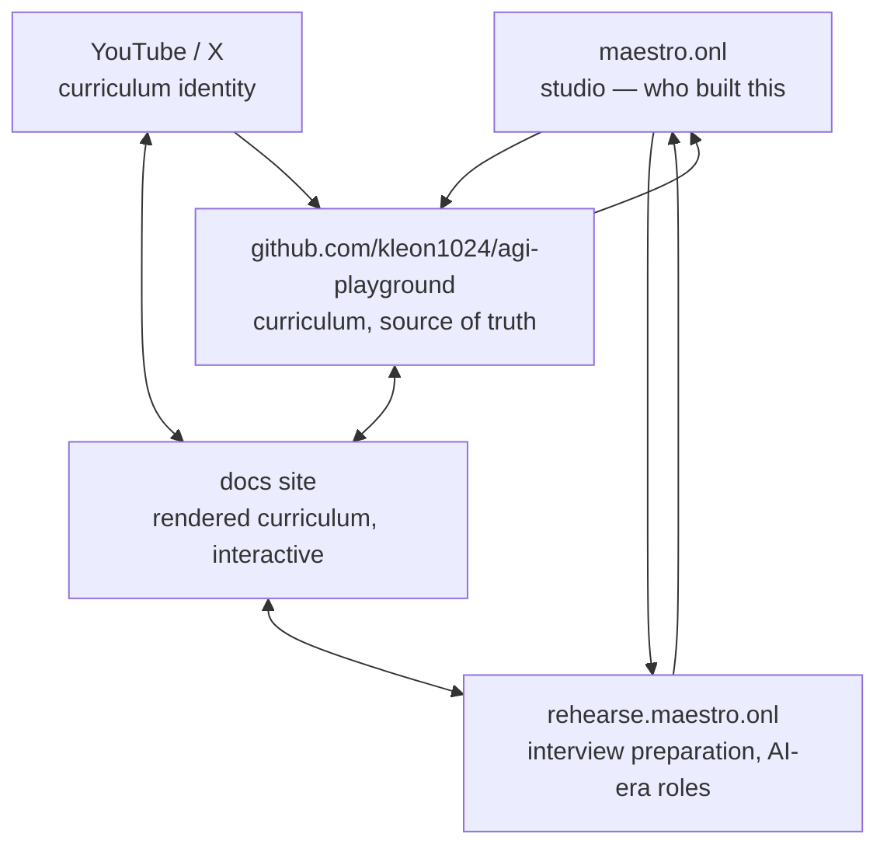

# Content and distribution architecture

How this repository relates to the other Maestro properties, and why.

## The principle

**Link where it serves the reader; do not link where it does not.** Search
engines evaluate topical authority at the site level, and audiences do the same
thing informally. Two properties should reference each other when a reader of
one genuinely wants the other — and not otherwise, because a link that does not
serve the reader is worth little and costs the receiving site's topical clarity.

The model worth copying is Karpathy's, and its mechanism is often misread. His
reach does not come from link-building. It comes from repository, video, and
social presence forming **one coherent identity around one subject**, sustained
for years. Topical consistency is the engine. What follows is arranged to
protect that.

## The properties

| Property | Subject | Audience |
|---|---|---|
| `agi-playground` (this repo) | Building AI systems: data, training, RL, serving, agents, ranking | Engineers who want to build and understand the stack |
| `rehearse.maestro.onl` | AI Engineer and MLE interview preparation | Engineers being examined on that stack |
| `maestro.onl` | The studio | Anyone evaluating who built these |

**The curriculum and Rehearse share an audience.** Someone learning how GRPO
works, or why a KV cache dominates serving memory, is very often someone who
will be asked about it in an interview. Someone preparing for an AI-role
interview frequently discovers they do not actually understand the systems
well enough and needs somewhere to learn them properly.

That is a real relationship, not a manufactured one — which is precisely what
makes linking the two defensible. This repository's material even originated in
interview preparation: the private corpus it was rewritten from is annotated
throughout with interview questions.

## The shape

Links that earn their place:

| From | To | What the reader gets |
|---|---|---|
| docs site | Rehearse | "You are learning this to be examined on it — practise that here." |
| Rehearse | docs site | "You were asked about KV caches and could not answer — learn it properly here." |
| repo ↔ docs site | | Source behind the prose; prose behind the source. |
| repo, docs, Rehearse | maestro.onl | Attribution. |
| maestro.onl | repo, Rehearse | Portfolio. |
| YouTube / X | docs, repo | The identity the videos belong to. |

The rule that keeps this honest: **each cross-link must name what the reader
gains.** A link that can only be justified by "we own both" is the kind that
dilutes topical clarity and converts nobody. If a lesson cannot say why a
reader would want Rehearse at that exact moment, it should not link to it.

Concretely, that means the link belongs on lessons whose subject is
interview-shaped — the conceptual explanations, the "common misconceptions"
sections — and not scattered into every page footer.

## Where the curriculum lives

The repository is the source of truth. Everything else renders or references
it; nothing forks it. Two divergent copies of a lesson is the failure mode to
avoid, and it is the same argument that produced a single canonical copy of the
governance rules elsewhere in this organisation.

**The docs site is not a nicety.** GitHub renders markdown adequately, but the
material here needs more than adequate: heavy mathematics (attention, GRPO
advantages, scaling laws), many diagrams, code that benefits from annotation,
and — most importantly — **interactivity**. A reader who can type a sentence and
watch this repository's own tokenizer merge it, step by step, learns BPE in a
way no static code listing achieves.

That is the bar: a coherent question → mechanism → manipulation → consequence
loop. Interactions are used when changing one variable can confirm a mental
model; diagrams are used when ownership and handoff are the lesson. More
components is not the goal.

**Video and social attach to the curriculum identity**, not to a product. Each
video points at the lesson it covers; each lesson can point back. That loop
compounds; scattered promotion does not.

## Design system

The playground mirrors the product's tokens rather than inventing its own, so
a reader crossing from `rehearse.maestro.onl` into `/playground` does not feel
a seam.

**Source of truth is `rehearse/src/app/globals.css`** — a Tailwind v4
`@theme inline` block. `site/src/css/brand.css` mirrors its named palette,
typography scale, and component semantics. `site/src/css/widgets.css` owns the
shared interactive-teaching surface so individual demonstrations do not invent
their own control or responsive rules. `site/src/css/diagrams.css` owns the
clickable process grammar that replaces Mermaid, and `site/src/css/labs.css`
owns the small causal labs. All three adapt vertically on a phone instead of
requiring horizontal scrolling.

Two things about that file are easy to get wrong, and both cost me time:

* **The `--color-*` entries are not dead.** They look unreferenced because
  nothing calls `var(--color-primary)`, but Tailwind v4 turns them into utility
  classes — `bg-primary`, `text-muted-foreground`, `border-border` — used
  hundreds of times. Deleting them on a "no `var()` usage" search would break
  the site.
* **Typography is two faces, not one.** Inter for body, Poppins for headings,
  applied through `@apply font-heading` on h1–h4. The compiled CSS references
  Next's generated font variables, so grepping the live stylesheet for
  "Poppins" finds nothing and suggests, wrongly, that it is unused.

The deployments remain independent. Visual acceptance compares the shared
header, palette, typography, border language, and responsive behavior on both
sites; a lesson release does not block the interview product.

## Practical notes

- **Repository metadata is discovery surface.** Topics, description, and
  homepage are how GitHub search and aggregators classify a project. Keep them
  accurate as scope grows.
- **The README is the landing page.** For most visitors it is the only page they
  read. It must make the argument, not list contents.
- **A canonical URL per lesson** is what makes external linking possible at all —
  from a video description, a post, or Rehearse.
- **Free, but structured.** Free content earns attention only when organised
  well enough to return to. The contracts in [`standards/`](../standards/) exist
  partly for this: they make lessons navigable and comparable rather than a pile
  of posts.

## A note on scope

Rehearse's own positioning and content are owned by its repository, not this
one. What is recorded here is only the contract between them: what each links
to, and why a reader would follow it.
