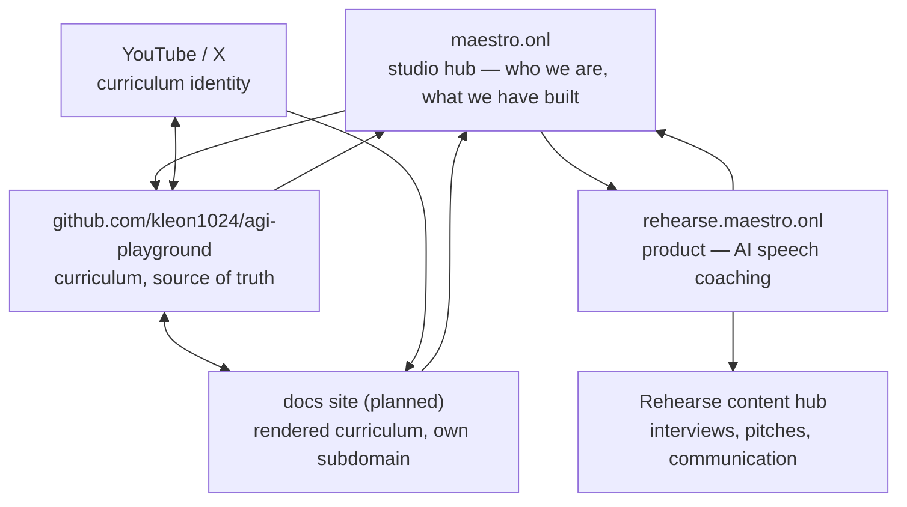

# Content and distribution architecture

How this repository relates to the other Maestro properties, and why it is
arranged this way rather than cross-linked to whatever else we own.

## The principle

**One property, one topic.** Search engines evaluate topical authority at the
site level, and audiences do the same thing informally. A domain that ranks for
"AI speech coaching" and a domain that ranks for "GRPO implementation" are
building two different reputations, and merging them costs both.

This matters more than it sounds, because the instinct to cross-link everything
you own is strong and usually wrong. A backlink from a topically unrelated
domain carries little weight, confuses the receiving site's subject, and sends
visitors who will not convert.

The model worth copying here is Karpathy's, and the mechanism is often
misread. His reach does not come from link-building between properties. It
comes from repository, video, and social presence forming **one coherent
identity around one subject**, sustained over years. Topical consistency is the
engine. Anything that dilutes it works against the very thing being imitated.

## The shape

Links that belong:

| From | To | Why it is legitimate |
|---|---|---|
| repo | maestro.onl | Attribution. Who built this. |
| docs site | repo | The code behind the prose. |
| repo | docs site | The prose behind the code. |
| maestro.onl | repo, Rehearse | Portfolio. A studio listing its work. |
| Rehearse | maestro.onl | Parent brand. |
| YouTube / X | repo, docs | The identity these belong to. |

Links that do **not** belong:

| From | To | Why not |
|---|---|---|
| Rehearse | curriculum | Different subject. Dilutes Rehearse's topical authority, sends non-converting traffic, and the backlink is nearly worthless in the other direction. |
| curriculum | Rehearse | Same problem, mirrored. A reader here wants the next lesson, not a speech-coaching product. |

If Rehearse needs content-driven growth, it needs **its own** content hub on
its own subject — interview preparation, pitch structure, communication under
pressure. That content is topically aligned, converts, and compounds. A
curriculum backlink does none of those things.

## Where the curriculum's content lives

The repository is the source of truth. Everything else renders or references
it, and nothing forks it — two divergent copies of a lesson is the failure mode
to avoid, and it is the same argument that produced a single canonical copy of
the governance rules elsewhere in this organisation.

**Now:** GitHub renders the curriculum acceptably. The README carries the
argument, and every lesson is readable in place.

**Next:** a docs site on its own subdomain, generated from the same markdown, so
the curriculum has a home that is not inside a code host — better typography,
search, and a canonical URL per lesson that can be linked from a video
description or a post. It must be generated from this repository, never
maintained separately.

**Later:** video and social. These attach to the curriculum identity, not to a
product. Each video points at the lesson it covers; each lesson can point back.
That is the loop that compounds.

## Practical notes

- **Repository metadata is discovery surface.** Topics, description, and
  homepage are how GitHub search and external aggregators classify a project;
  they are set, and should be kept accurate as scope grows.
- **The README is the landing page.** For most visitors it is the only page
  they will read. It has to make the argument, not list the contents.
- **A canonical URL per lesson** is what makes external linking possible at
  all. Until the docs site exists, deep links point at repository paths.
- **Free, but structured.** Free content earns attention only when it is
  organised well enough to return to. The mission and lesson contracts in
  [`standards/`](../standards/) exist partly for this reason: they make the
  content navigable and comparable rather than a pile of posts.
