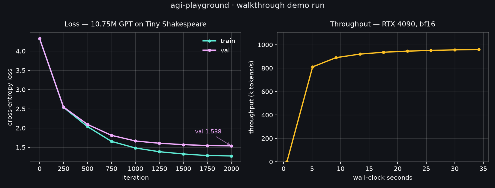

# Your first training loop

**Goal:** train a GPT end to end, from raw text to generated samples, in one
readable file and under a minute of GPU time.

This is the smallest *complete* pretraining loop — tokenizer, model, training
loop, sampler, all written out, nothing imported from a framework. Everything
later in the curriculum is this loop with better answers to each question:
[stage 01](../../missions/01-language-model-agent/01-tokenizer/) replaces the character tokenizer
with a real BPE, [stage 02](../../missions/01-language-model-agent/02-pretrain/) replaces
Shakespeare with 3B tokens of filtered web text, and track 06 replaces the
naive sampler with a paged-KV inference engine.

Run it first. Understand it second. It takes 34 seconds.

```bash
python core/train_gpt.py
```

**Before this:** [the decoder block](../00-attention/) if you want the forward
path explained first. Otherwise nothing — this chapter is the shortest complete
loop in the repository.

## What it builds

A 10.75M-parameter decoder-only transformer: 6 layers, 6 heads, 384 embedding
dimensions, 256-token context, trained on Tiny Shakespeare (1.1MB) at the
character level.

```
component                                       params
------------------------------------------------------
token embedding (tied with output head)         24,960
position embedding                              98,304
per block · attn qkv proj                      442,368
per block · attn output proj                   147,456
per block · mlp up (4x)                        589,824
per block · mlp down                           589,824
per block · 2 LayerNorms                         1,536
------------------------------------------------------
per block total                              1,771,008
x 6 blocks                                  10,626,048
final LayerNorm                                    768
TOTAL                                       10,750,080  (10.75M)
```

**Notice the ratio: the MLPs hold 65.8% of the parameters, attention only
32.9%.** That roughly 2:1 split holds in essentially every GPT, because the
MLP's 4× expansion (384 → 1536 → 384) costs more than the QKV and output
projections combined. People associate transformers with attention, but most of
the weights — and, per the interpretability literature, most of the stored
factual knowledge — live in the MLPs. This is also why Mixture-of-Experts shards
the MLP and not the attention.

## What happened



```
vocab=65  params=10.75M  device=NVIDIA GeForce RTX 4090
iter     0  train 4.3266  val 4.3272     0.6s      0.0k tok/s
iter   500  train 2.0374  val 2.0952     9.2s    889.7k tok/s
iter  1000  train 1.4815  val 1.6638    17.5s    935.8k tok/s
iter  1500  train 1.3269  val 1.5698    25.8s    951.5k tok/s
iter  2000  train 1.2753  val 1.5383    34.2s    959.5k tok/s

peak VRAM: 1.65 GB
```

Three numbers in there are worth more than the rest.

**The starting loss, 4.3266, is not arbitrary.** `ln(65) = 4.174` is the
cross-entropy of a uniform distribution over 65 characters — what a model that
has learned nothing should score. Landing just above it means the network is
initialized sensibly and the loss is wired to the right target. **Check this on
every model you ever train**: if step 0 is far from `ln(vocab_size)`, you have a
bug in initialization, in the loss, or in the label alignment, and no amount of
training will fix it. If step 0 is far *below* it, your labels are leaking into
the inputs.

**The final validation loss, 1.538, means perplexity ≈ 4.7.** The model has
narrowed "which character comes next" from 65 roughly-equal options to about 5.

**Peak VRAM was 1.65 GB of the card's 24 GB — 7%.** Almost nothing here is
limited by the GPU.

## When did it stop learning and start memorizing?

Both losses fall the whole way, so "is it still learning?" cannot be answered by
watching the training loss. The quantity that answers it is the *distance between
the two curves*. Step through the nine recorded checkpoints and watch how each
250-iteration interval divides its improvement between them.

<!-- interactive: TrainingLossCurve -->

Early on the split is even: from iteration 0 to 250 the training loss falls
1.7891 and the validation loss falls 1.7824, essentially all of it. What the
model learns there — which letters follow which — is true of English generally,
so it transfers to text the model has never seen.

By the last interval the split has inverted. From iteration 1750 to 2000 the
training loss falls 0.0091 while the validation loss falls 0.0064, and the gap
has grown from 0.0006 to **0.2630**. The remaining improvement is increasingly
purchased on the training set alone. That is the number the next section is
about.

## What the model learned, and what it didn't

```
ANGELO:
Any coward, is the time: and bubzed in my reason
That answer'd thee use as they come.

Harery:
We must follow'd on my tongue to the chamber:
Though with is the neck; ladiest drop the deed?
```

It learned the *shape* of the data with real fidelity: capitalized speaker
names, the colon convention, line lengths, plausible English orthography and
morphology. It learned no *meaning*. "bubzed" and "ladiest" are not words; they
are statistically well-formed guesses about what letters follow other letters.

This failure is the lesson, and it is not a failure of the architecture, the
optimizer, or the hardware. **It is a failure of data.** The training set is
1.1MB of unique text, and 2000 iterations at 16,384 tokens each means the model
saw it about 30 times over. Chinchilla-optimal training for 10.75M parameters
wants on the order of 215M *unique* tokens; we supplied roughly 0.3M. The
train/validation gap opening up (1.275 vs 1.538) is that memorization becoming
visible.

You cannot fix this model by making it bigger. That is the entire argument for
why [stage 00](../../missions/01-language-model-agent/00-corpus/) — building a real corpus — comes
before stage 02.

## Reading the code

`core/train_gpt.py` is ~190 lines. The parts worth pausing on:

- **`CausalSelfAttention.forward`** reshapes to `(B, n_head, T, head_dim)` so
  the heads become a batch dimension — every head runs as an independent
  attention operation in one matmul. The call to
  `F.scaled_dot_product_attention(..., is_causal=True)` builds the mask
  internally and dispatches to FlashAttention, which is why memory stays flat
  in sequence length instead of materializing a `T×T` matrix.
- **`Block.forward`** is two lines, and both are `x = x + sublayer(norm(x))`.
  That is a pre-norm residual stream: normalization happens *inside* the branch,
  so the `+x` path stays an unobstructed gradient highway from the loss to the
  embeddings. Post-norm transformers (the original 2017 design) put the norm on
  the highway itself and need learning-rate warmup to train at all.
- **Weight tying** (`self.tok.weight = self.head.weight`) makes the input
  embedding and output projection the same matrix. It saves parameters and
  reflects a real symmetry: "which token is this" and "which token comes next"
  are questions about the same vocabulary geometry.
- **`torch.autocast("cuda", dtype=torch.bfloat16)`** runs matmuls in bfloat16
  while keeping the master weights in fp32. bf16 has fp32's exponent range with
  fewer mantissa bits, so it does not need the loss scaling that fp16 requires.

## Exercises

1. **Break the sanity check.** Initialize the output head with a large constant
   instead of the default. Watch step 0 diverge from `ln(65)` and confirm the
   model never recovers.
2. **Remove the residual connections** (`return self.attn(self.ln1(x))` instead
   of `x + ...`). It will fail to train. That is the clearest demonstration
   available of what residuals are for.
3. **Move the norm onto the highway** (post-norm: `x = self.ln1(x + attn(x))`)
   and watch training destabilize without warmup.
4. **Fix the data instead of the model.** Concatenate several public-domain
   books so the corpus is 20× larger, keep the model identical, and compare the
   train/validation gap. The samples improve without a single architecture
   change.
5. **Find the compute ceiling.** The run uses 7% of a 24GB card. Raise batch
   size and model width until you fill it, and measure where throughput stops
   scaling.

## Next

[Track 03 — pretraining](../../platform/training/) generalizes every choice made
here, or jump to [stage 00](../../missions/01-language-model-agent/00-corpus/) to build the corpus
this model was starved of.
