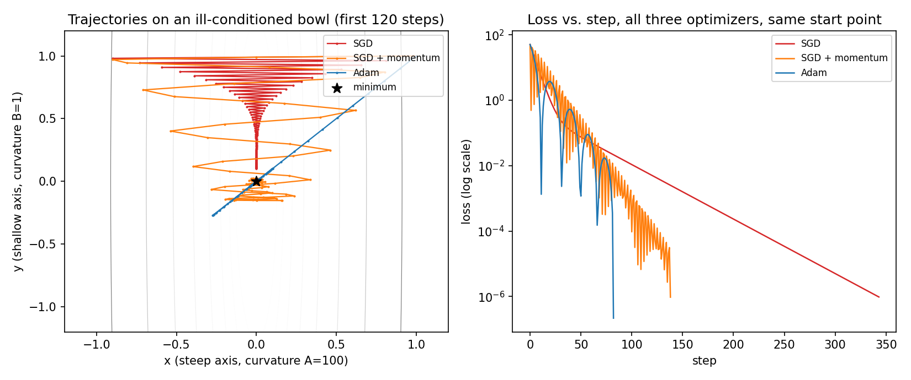

# Why do SGD, momentum, and Adam disagree on the same loss surface?

**Goal:** implement all three optimizers from scratch — no `torch.optim` — and
race them on one deliberately lopsided bowl, so the difference between "an
update rule" and "a mechanism" stops being abstract.

[The first training loop](../01-first-training-loop/) trains a real GPT with
one optimizer chosen for you (Adam, implicitly, since that is what most
training loops reach for). This chapter asks the question that loop skips:
why that optimizer, and not the simpler one it replaced?

**Before this:** [the first training loop](../01-first-training-loop/), so you
have already seen one backward pass and one weight update happen. This chapter
does not need a neural network — a plain quadratic function exposes the same
mechanism with nothing else in the way.

Run it first. Understand it second. It takes under two milliseconds.

```bash
python core/optimizers.py
python core/plot_trajectories.py
```

## 1. Build a bowl a real network actually has

Take the simplest possible loss: a quadratic bowl with two directions.

$$
L(x, y) = \tfrac{1}{2}\left(A x^2 + B y^2\right)
$$

Set $A = 100$, $B = 1$. This is not a contrived edge case — it is what a
neural network's loss surface looks like locally, almost everywhere. Some
directions in parameter space (a large weight matrix's dominant singular
direction) curve sharply; others (a rarely-used embedding row) barely curve at
all. The ratio $A/B$ is the **condition number**, and 100 is a modest one — a
real transformer's Hessian can range over many more orders of magnitude
between its steepest and flattest directions.

Starting at $(1, 1)$, the true minimum is $(0, 0)$, and the gradient is exact
and closed-form: $\nabla L = (Ax, By)$. Nothing here is approximated, so every
optimizer's update is the literal arithmetic it would perform on a real
parameter, just without a network attached to generate the gradient.

## 2. Watch plain SGD zigzag

Gradient descent's update is the gradient itself, scaled by a learning rate:

$$
p \leftarrow p - \eta \nabla L(p)
$$

Along the steep axis, this is $x \leftarrow x(1 - \eta A)$. With $\eta = 0.019$
and $A = 100$, that factor is $1 - 1.9 = -0.9$ — **negative**. Every single
step overshoots the minimum and lands on the opposite side, closer in
magnitude but on the wrong side of zero again next step. That is not a bug in
the learning rate choice; it is the *only* available behavior once $\eta A$
exceeds 1, for any $\eta$ small enough to not diverge on the shallow axis
($\eta B \ll 1$). A single fixed learning rate cannot be simultaneously
"aggressive enough to move along $y$" and "gentle enough to not overshoot
along $x$," because $x$ and $y$ disagree on what aggressive means by a factor
of 100.



**Measured** (`runs/optimizer-comparison.json`): plain SGD needed **343 steps**
to reach loss $< 10^{-6}$, flipping sign on the steep axis **341 times** —
essentially every step, for the entire run. The left panel's red path is a
staircase hugging the x-axis: it is not walking toward the minimum, it is
ringing around it while the shallow $y$ direction creeps down almost
unnoticed.

## 3. Add velocity, and the ringing damps

Momentum keeps a running velocity and updates position by that velocity, not
by the raw gradient:

$$
v \leftarrow \mu v - \eta \nabla L(p), \qquad p \leftarrow p + v
$$

The mechanism: on the steep axis, successive gradients point in opposite
directions once oscillation starts (exactly the SGD failure above) — so their
contributions to $v$ **partially cancel**, shrinking the effective step size
on that axis automatically. On the shallow axis, successive gradients point
the *same* direction for many steps in a row, so their contributions to $v$
**accumulate**, growing the effective step size on that axis. One velocity
term does both jobs at once, without knowing which axis is which; the
cancellation and accumulation fall out of the sign pattern of consecutive
gradients, not from any per-axis logic written into the update.

**Measured:** momentum ($\eta = 0.01$, $\mu = 0.9$) reached tolerance in **138
steps** — 2.5x fewer than plain SGD — with only **47** sign flips on the steep
axis, a damped oscillation rather than a sustained one. The orange path in the
plot still wobbles at the start, then straightens.

## 4. Adapt the step size per parameter, and the wobble mostly disappears

Adam keeps two running estimates per parameter: a mean of recent gradients
($m$) and a mean of recent *squared* gradients ($v$), then divides the step by
$\sqrt{v}$:

$$
m \leftarrow \beta_1 m + (1-\beta_1) g, \qquad
v \leftarrow \beta_2 v + (1-\beta_2) g^2
$$

$$
p \leftarrow p - \eta \, \frac{\hat{m}}{\sqrt{\hat{v}} + \epsilon}
$$

($\hat{m}, \hat{v}$ are $m, v$ divided by $1-\beta^{\text{step}}$, a bias
correction for the fact that $m$ and $v$ start at zero.) The mechanism worth
isolating: $g / \sqrt{\overline{g^2}}$ is a *normalized* step, close to $\pm 1$
in magnitude regardless of how large $g$ actually is. The steep axis produces
large gradients, so $v$ grows large there and divides the step back down; the
shallow axis produces small gradients, so $v$ stays small there and the step
stays close to its full size. This is why Adam can use **one global learning
rate** ($\eta = 0.1$ here, ten times SGD's) across two parameters whose raw
gradient scales differ by 100x, with no per-parameter tuning at all.

**Measured:** Adam reached tolerance in **82 steps** — 4.2x fewer than plain
SGD, 1.7x fewer than momentum — with only **4** sign flips. The blue path in
the plot moves almost straight at the minimum from the first few steps.

| optimizer | steps to converge | sign flips (steep axis) | final loss |
|---|---|---|---|
| SGD | 343 | 341 | 9.6e-7 |
| SGD + momentum | 138 | 47 | 9.5e-7 |
| Adam | 82 | 4 | 2.2e-7 |

## 5. Change the conditioning, and see which number actually moves

The three step counts above were measured on one bowl. The obvious next question
is which of them the condition number is responsible for — so change $A$ and hold
everything else, including all three learning rates, exactly where the run record
set them. Predict first: if oscillation is what makes plain SGD slow, then making
the bowl gentler should make SGD converge in fewer steps.

<!-- interactive: OptimizerTrajectory -->

It does not. At $A = 10$ plain SGD stops overshooting entirely — zero sign flips
instead of 341 — and still needs **343 steps**, the same number it needed at
$A = 100$. The oscillation was never the thing setting the pace. Along the
shallow axis the update is $y \leftarrow y(1 - \eta B) = 0.981y$, and reaching
$L < 10^{-6}$ from $y = 1$ takes 343 steps of that decay whether or not the steep
axis is ringing. Fixing the zigzag alone would have bought nothing; what momentum
and Adam actually buy is a *larger effective step on the shallow axis*, which is
why their step counts fall when SGD's does not.

At $A = 1000$ the same fixed learning rates that were stable before now diverge
for both SGD ($\eta A = 19$) and momentum (whose bound $2(1+\mu)/A = 0.0038$ has
fallen below its $\eta = 0.01$). Only Adam still converges, because its step size
is set by the gradients it observes rather than by a constant chosen against a
curvature that no longer holds.

## What this does not establish

This is a two-parameter convex bowl with a hand-picked condition number and
three hand-picked learning rates. It does not establish that Adam is always
faster than momentum, or that these specific learning rates are anywhere near
optimal for any of the three — a fair comparison would sweep $\eta$ for each
optimizer and report the best of each, which this chapter deliberately does
not do, so the comparison stays about *mechanism* (why each behaves as it
does) rather than a leaderboard. It says nothing about a real neural network's
non-convex loss surface, where curvature changes from point to point and
saddle points, not ill-conditioning, are often the harder problem. **That
question is answered empirically, not by this toy** — [the first training
loop](../01-first-training-loop/) and
[01-language-model/02-pretrain](../../01-language-model/02-pretrain/)
are where a real, high-dimensional loss surface is measured, with Adam as the
optimizer actually used and never re-derived from a toy comparison like this
one.

## A brief, dated history

Three update rules, arriving decades apart, each keeping what the last one
established.

<!-- interactive: OptimizerLineage -->

One clarification the axis above deliberately leaves out:

- This repository's own later frontier-lineage material (GRPO, GMPO, GSPO in
  [mission 01's RL stage](../../01-language-model/04-rl/what-a-real-loop-adds/))
  is a distinct, higher layer: those are *policy*-optimization objectives for
  RL-style post-training, not base optimizers. They are typically paired with
  Adam (or AdamW) underneath them, not built to replace it — this chapter is
  the prerequisite layer those sit on top of.

## Check your mental model

**1. Why can no single fixed learning rate make plain SGD both fast on the
shallow axis and stable on the steep axis?**

<details>
<summary>Answer</summary>

Because the two axes disagree on what "aggressive" means by a factor equal to
the condition number ($A/B = 100$ here). Stability on the steep axis requires
$\eta < 2/A$; real progress on the shallow axis wants $\eta$ as large as
possible relative to $1/B$. Any $\eta$ satisfying the first constraint is,
by construction, 100x smaller than what the second axis could tolerate — the
same scalar cannot serve both a curvature of 100 and a curvature of 1 well at
once.

</details>

**2. Momentum's velocity term does two opposite jobs — damping and
acceleration — with the same equation. What distinguishes which job happens
on which axis?**

<details>
<summary>Answer</summary>

The sign pattern of consecutive gradients on that axis. Where gradients
alternate sign step to step (the steep axis, once oscillation starts), their
contributions to the velocity partially cancel, shrinking the effective step.
Where gradients keep the same sign for many steps in a row (the shallow
axis), their contributions accumulate, growing the effective step. It's the
same formula in both cases — the outcome depends entirely on which gradient
sequence it's fed, not on any per-axis special-casing.

</details>

**3. Adam divides each parameter's step by that parameter's own running
$\sqrt{\overline{g^2}}$. Why does this remove the need to hand-tune a
learning rate per parameter?**

<details>
<summary>Answer</summary>

Because dividing a gradient by (an estimate of) its own root-mean-square
magnitude produces a normalized quantity whose scale is close to 1 regardless
of the gradient's raw size. A parameter with large gradients (the steep axis)
gets divided by a large number; a parameter with small gradients (the
shallow axis) gets divided by a small number. The result is that one global
$\eta$ multiplies a roughly-unit-scale step for every parameter, so
per-parameter differences in curvature are absorbed by the normalization
itself instead of requiring a differently-tuned $\eta$ for each one.

</details>

**4. This chapter measures 343 vs. 138 vs. 82 steps. What would make that
comparison misleading if quoted outside this chapter?**

<details>
<summary>Answer</summary>

The three learning rates were each hand-picked for this one bowl (a specific
$\eta$ near SGD's stability limit, a specific $\eta,\mu$ pair for momentum, a
round $\eta=0.1$ for Adam) rather than swept for a best-case comparison, and
the surface itself is a two-parameter convex quadratic with one fixed
condition number — not a real, high-dimensional, non-convex network loss.
The step counts are real and reproducible on this exact setup, but "Adam
converges 4x faster" is not a claim this chapter's evidence extends to any
other loss surface, learning-rate schedule, or model.

</details>

## Reading the code

`core/optimizers.py` is under 150 lines and implements all three update rules
directly on numpy arrays — no autograd, because the gradient of a quadratic is
one line to write by hand. `core/plot_trajectories.py` re-runs the same
comparison and renders the trajectories and loss curves in
`runs/trajectories.png`, so the plot can never drift from the numbers in
`runs/optimizer-comparison.json`.

## Exercises

1. **Push SGD's learning rate past $2/A = 0.02$.** Watch the steep axis
   diverge instead of oscillate — the same mechanism, one step further.
2. **Raise momentum's $\mu$ toward 1.** Predict whether convergence gets
   faster or slower, then run it. (Too much memory of past velocity fights
   the cancellation that damps the steep axis.)
3. **Re-tune each learning rate for $A = 1000$** instead of holding the three
   the widget above holds fixed. SGD and momentum both diverge at that
   conditioning on the original settings; find the largest $\eta$ each can
   survive, then compare step counts again. This is the fair comparison section
   "What this does not establish" says the chapter deliberately does not run.
4. **Remove Adam's bias correction** ($\hat m = m$, $\hat v = v$ instead of
   dividing by $1-\beta^{\text{step}}$) and compare the first ~20 steps. The
   uncorrected estimates start at exactly zero, so the first few updates are
   artificially small — this is what the correction exists to fix.

## Next

[Pretraining](../../01-language-model/02-pretrain/) uses Adam (via AdamW) at real
model scale, where this chapter's toy condition number of 100 is replaced by
whatever the actual Hessian of a transformer produces — measured, not
assumed. Or return to [the first training loop](../01-first-training-loop/)
and change its optimizer to plain SGD to see this chapter's mechanism affect
a real, if tiny, GPT.

A detour from here: [fewer flips is what makes fewer steps
possible](the-flips-that-separate-optimizers/) — the recorded comparison
read: SGD flips across the steep axis on 341 of 343 steps, momentum damps
it (47/138), Adam nearly removes it (4/82), and the flip count is why the
step counts differ.
