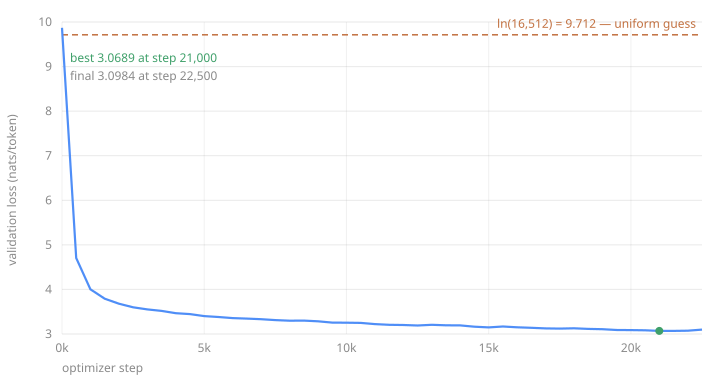

# What decides whether this run is training correctly?

**Question:** you have 3.16B tokens from [stage 00](../00-corpus/) and a
16,512-token vocabulary from [stage 01](../01-tokenizer/). Starting the run is
one command. It will take about five hours. What can you check in the first
minute that tells you the next five hours are not wasted?

The artifact this stage produces is a checkpoint plus the history that makes it
believable: a configuration, optimizer moments, tokens seen, and a validation
curve. Everything below is about the small number of checks that separate a run
that is training from a run that is merely running.

<!-- interactive: PretrainingLoop -->

## The check you can make at step one

A randomly initialized model knows nothing about the next token, so the best it
can do is spread probability evenly across the vocabulary. Its cross-entropy
loss is therefore the log of the vocabulary size: `ln(16,512) = 9.712` nats. Any
model that has not yet learned anything must start there.

Predict what it means if step 0 comes out well *below* that line before you look
at the number.

<!-- interactive: InitLossCheck -->

Far below means the model is seeing the answer — a label-shifting bug, a mask
that lets attention read the token it is predicting, a validation file that
overlaps training. Far above means initialization or the loss reduction is
wrong. This run measured **9.8697**, sitting 0.158 above the uniform line, which
is the small excess expected when weights are random rather than exactly uniform
in effect.

That one number costs one forward pass and rules out most of the ways a
pretraining run can be silently broken. Nothing else in this chapter is
available so early or so cheaply.

## What you are actually training

The check above says the wiring is right. This is what the wiring holds: one
block, repeated twelve times, with a residual stream running through it at a
constant width of 768.

<!-- interactive: ModelArchitecture -->

Move the key/value head count and watch two numbers move in opposite
directions. Dropping from 12 KV heads to 4 costs 9,437,184 parameters of
attention capacity — and divides the KV cache by three, from 36,864 to 12,288
bytes per token. That trade is paid once at training time and collected on
every request for the life of the model, which is why
[serving](../../../platform/serving/) cares about it more than training does.

Note where the parameters actually sit: the feed-forward block holds more than
twice what attention does. That is the usual shape, and it is why
mixture-of-experts designs attack the feed-forward block rather than attention.

## What the budget commits you to

The token budget is the second decision that cannot be fixed later. This run
spent 3.0B tokens on 88,197,888 parameters — roughly 34 tokens per parameter,
against the Chinchilla-optimal ratio of about 20. It is deliberately
over-trained: the compute-optimal ratio minimizes loss for a *training* budget,
while a model you intend to serve is better spent past that point, because
inference cost depends on parameters and not on how long you trained them.

3.0B tokens do not fit in 24GB, so the optimizer step is assembled from pieces.
A micro-batch of 16 sequences of 1,024 tokens is what fits; eight of those
accumulate into one optimizer step of 131,072 tokens.

<!-- interactive: GradientAccumulation -->

Dividing each micro-batch loss by the accumulation count is part of the
algorithm, not bookkeeping. Omit it and the gradient is scaled by eight, which
is identical to multiplying the learning rate by eight — a silent change to the
optimization problem that no log line reports.

## Whether the hardware is doing the work

The loop is correct and the budget is set; the run still takes as long as the
hardware is used well. Model-FLOPs utilization is the fraction of the card's
theoretical throughput that the run actually converts into training.

<!-- interactive: MFUBreakdown -->

The first measurement on this configuration was 85.5k tokens/second at 33.3%
MFU, which projected to roughly 9.8 hours. Enabling `torch.compile` moved it to
165.6k tokens/second and 64.5% — a **1.76x** speedup, and a finished run in
**4.98 hours**. The gap was not arithmetic; it was memory-bound elementwise work
and kernel-launch overhead that fusion removes.

The lesson generalizes past this flag: a wall-clock estimate inherited from a
differently-configured run is a guess wearing a number.

## What five hours actually bought

A validation curve is only evidence if the held-out tokens were never
optimized, so [`core/prepare_data.py`](core/prepare_data.py) writes the
validation file *before* the training file and the loop memory-maps them
separately — a training window cannot reach into validation data because it is
not in the same file. The writer also inserts a reserved document separator;
without it the model would learn that the last sentence of one page predicts
the first sentence of an unrelated one. Both files are `uint16`, which this
16,512-token vocabulary fits in, halving storage and memory traffic against
`int32` at no cost.



Loss fell from 9.8697 to a best of **3.0689** at step 21,000, a validation
perplexity of 21.5. It then rose to 3.0984 by step 22,500 — the final 6.5% of
the budget went the wrong way, while the learning rate was still decaying toward
its floor.

<!-- interactive: LRSchedule -->

Three explanations fit: the model is beginning to overfit as it approaches one
full epoch over the corpus (0.95 at the end); the cosine floor is too high to
settle; or it is evaluation noise, since each point samples the validation set
rather than consuming it. **This run cannot distinguish them**, because it is one
run. Separating them needs the paired multi-seed comparison in
[the data-ablation harness](../../../platform/data/01-ablation-harness/).

Reported at both numbers rather than the better one, and the saved checkpoint is
the final one, not the best-scoring one.

## Fluent, and useless

The most important output of this stage is not the curve. Sampled from the
final checkpoint:

> **The capital of France is** the city of Monaco, which is the largest city in
> the Mediterranean.

> **Photosynthesis is the process by which** the sun shines on the Earth, or in
> the atmosphere, to provide oxygen for a person to breathe.

Grammatical, confident, and wrong. The model learned English morphology,
syntax, register, and the shape of an encyclopedia paragraph. It did not learn
that photosynthesis is performed by plants or that Monaco is not in France, and
at 88M parameters over 3.0B tokens it was never going to.

This is the correct result, and it is the reason a falling loss curve is not a
claim about a working model. Fluency is cheap; grounding is not.

## What this run does not establish

That any of the architecture choices are good ones. There is one arm, one seed,
and no comparison — so nothing here says RMSNorm beat LayerNorm, or that
grouped-query attention cost nothing. Those are separate experiments with a
stated budget definition, in
[architecture ablations](../../../platform/training/02-architecture-ablations/).

Full command, hardware, software versions, generations, and the two monitoring
mistakes worth avoiding are in
[`runs/2026-07-28-pretrain-3b.md`](runs/2026-07-28-pretrain-3b.md).

## Reproduce it

```bash
cd missions/01-language-model-agent/02-pretrain/core
python model.py                                    # parameter and KV-cache budget, no training
python prepare_data.py <parquet-dir> <tokenizer.json> --out-dir data/tokens
python train.py --data data/tokens --out ckpt --tokens 3.0e9 --compile
```

[`prod/train_prod.py`](prod/train_prod.py) runs the same configuration through
HuggingFace `Trainer` and `LlamaForCausalLM`. The two agree at exactly
88,197,888 parameters, because the four choices in `core/model.py` are Llama's
architecture written out longhand.

## Check your mental model

1. Why is `ln(vocab_size)` the loss a correctly initialized model must start at,
   and what does a step-0 loss of 5 imply?
2. Why does omitting the division by the accumulation count change the learning
   rate rather than just the logged loss?
3. This run used 34 tokens per parameter against a compute-optimal 20. Why is
   over-training the right call for a model you intend to serve?
4. Validation loss rose over the last 1,500 steps. Name the three explanations
   and say what evidence would separate them.
5. The model writes fluent English and states that Monaco is the capital of
   France. Which of those two facts is surprising at this scale?

## Next

[Stage 03](../03-sft/) changes the learning target. Instead of predicting every
corpus token, it teaches this base model to follow a conversation template,
masking the loss outside the assistant's response — the first step in turning a
fluent text predictor into something that answers.
