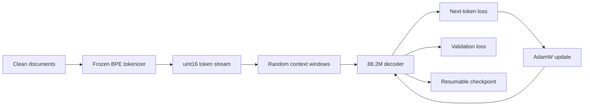

# Stage 02 — Pretrain

This stage turns the cleaned corpus and trained tokenizer from stages 00 and 01
into a decoder that can predict the next token. The model is intentionally
small enough for one 24GB GPU, but the data path, architecture, optimizer state,
evaluation loop, and checkpoint boundary are the same decisions that survive at
larger scale.

The complete pretraining run is not finished. A short GPU run has verified that
the model, token files, mixed-precision path, optimizer, schedule, evaluation,
and checkpoint code work together. That distinction matters: a working loop is
evidence about engineering, not evidence about model quality.

## The system you are building



The output is not just a weight file. A useful training artifact includes the
model configuration, optimizer moments, current step, tokens seen, evaluation
history, and enough metadata to resume without silently changing the run.

## Data contract: tokenize once, train many times

[`core/prepare_data.py`](core/prepare_data.py) converts the parquet corpus into
two flat token files. The training loop memory-maps those files and samples
random windows, so the CPU does not tokenize the same text again on every
epoch.

The files use `uint16`, not `int32`, because this vocabulary has fewer than
65,536 entries. That halves storage and memory traffic without losing
information. The data writer also inserts a reserved document separator. Without
that boundary, the model would learn that the last sentence of one page predicts
the first sentence of an unrelated page.

Validation tokens are written to a separate file before training tokens. A
training window therefore cannot cross into validation data. This is a small
implementation choice with a large consequence: a falling validation loss only
means something when the held-out tokens were never optimized.

## Architecture: four independent choices

[`core/model.py`](core/model.py) uses a modern decoder block:

- **RMSNorm** rescales by root mean square without subtracting the mean.
- **RoPE** rotates query and key channels so attention encodes relative
  position without a learned absolute-position table.
- **SwiGLU** gates one projection with another and trades the usual MLP shape
  for more useful nonlinear capacity at a comparable parameter budget.
- **Grouped-query attention** keeps twelve query heads but shares four
  key/value heads. The model still has diverse queries while its future KV
  cache is three times smaller than full multi-head attention.

These choices solve different problems. Treating them as one “modern
architecture” switch hides the reasoning: RMSNorm changes normalization cost,
RoPE changes position representation, SwiGLU changes the feed-forward block,
and grouped-query attention buys serving memory during pretraining.

The default configuration is twelve layers, model width 768, twelve query
heads, four key/value heads, a 2,048-wide feed-forward block, and a 1,024-token
context. It contains 88,197,888 trainable parameters. That number comes from
the executable model summary, not a rounded target.

## Training loop: make the effective update explicit

The loop in [`core/train.py`](core/train.py) separates the micro-batch that fits
in memory from the effective batch used by the optimizer. Several
micro-batches accumulate gradients before one optimizer step.

<!-- interactive: GradientAccumulation -->

Dividing each micro-batch loss by the accumulation count is part of the
algorithm. Omitting that division does not merely change a log line: it scales
the gradient, which is equivalent to multiplying the learning rate by the
number of accumulated micro-batches.

The schedule warms up linearly, then follows cosine decay toward a non-zero
floor. Warmup prevents the full step size from hitting Adam's poorly estimated
moments at the start of training. The floor avoids ending the run with a step
size so small that remaining tokens contribute almost nothing.

<!-- interactive: LRSchedule -->

The loop also clips gradient norm, evaluates on held-out windows, records
tokens per second and model-FLOPs utilization, and saves optimizer state with
the model. Each mechanism has one owner and one observable failure mode; there
is no separate “training stability” patch layered on top.

## What the verification run established

The recorded mechanics run used a temporary 1,024-token tokenizer and only
fifteen optimizer steps. It established the following facts:

- the model contains 88,197,888 parameters;
- the input pipeline produced separate train and validation token files;
- the step-zero loss was close to the uniform-vocabulary baseline;
- validation loss fell during the short run;
- checkpoint, evaluation, and metric paths executed together;
- the measured peak allocation fit inside the declared local lane.

The exact command, hardware, timing, throughput, memory, and output are in the
[run record](runs/2026-07-26-loop-mechanics.md). Those numbers stay in the run
record because they belong to one environment and one execution, not to the
timeless explanation of the mechanism.

## What remains unproven

The mechanics run does not establish language quality, convergence, or the
value of any architecture choice. Fifteen steps are too few, and the temporary
tokenizer fragments text differently from the final tokenizer.

The complete run must use stage 01's final vocabulary and stage 00's published
corpus. It must report the full configuration, loss curve, wall-clock time,
tokens per second, model-FLOPs utilization, peak memory, and a resumable
checkpoint. Until that record exists, this stage remains `draft`.

## Reproduce the verified path

Prepare token files:

```bash
cd missions/01-language-model-agent/02-pretrain/core
python prepare_data.py <parquet-dir> <tokenizer.json> --out-dir data/tokens
```

Print the parameter and KV-cache budget without training:

```bash
python model.py
```

Run the training loop:

```bash
python train.py --data data/tokens --out checkpoints/pretrain
```

Read the command help before changing batch size, context length, accumulation,
or schedule. Those values interact: increasing context raises activation
memory, changing accumulation changes the effective batch, and changing the
effective batch without reconsidering learning rate changes the optimization
problem.

## Exercises

1. Set accumulation to four and then eight while holding the micro-batch fixed.
   Confirm when the optimizer steps and explain why the unscaled-loss variant
   changes the effective learning rate.
2. Disable warmup for a short smoke run. Compare the first updates rather than
   claiming a final-quality difference from too few steps.
3. Set `n_kv_head` equal to `n_head`, print the cache bytes per token, and
   explain why this pretraining choice changes serving capacity.
4. Remove the document separator in a tiny synthetic corpus. Inspect windows
   that cross document boundaries and state what false dependency they teach.
5. Save, resume, and confirm that step, optimizer moments, tokens seen, and
   history continue instead of restarting.

## Next

[Stage 03](../03-sft/) changes the learning target: instead of predicting every
corpus token, it teaches the base model to follow a conversation template and
masks loss outside the assistant response.
