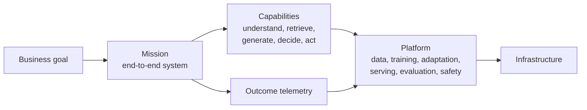

# Build AI systems from infrastructure to measurable outcomes

从基础设施出发，组合泛 AI 能力，交付可衡量的业务结果。

Most AI curricula teach how a model is made. That is a pipeline, and it explains
one artifact well — but it cannot express who a system serves, what decision it
makes on their behalf, or whether it worked.

This teaches the durable skill instead: **given a problem, identify the decision
loop, choose the AI capabilities that serve it, build the system, and prove the
outcome.**

:::tip The two invariants
**Every capability claim is backed by a run. Every mission is backed by a
measurable outcome.**

Technical numbers trace to a run record naming the command, hardware, wall-clock
and cost. Business outcomes cannot be executed on a GPU, so missions prove them
against declared, reproducible proxies — and every mission states what it does
*not* establish.
:::

## Try it: the tokenizer we trained

Everything here is built, not described. Below is the actual 16,384-token
vocabulary from mission 01, running in your browser — type anything.

import TokenizerPlayground from '@site/src/components/TokenizerPlayground';

<TokenizerPlayground />

:::note Why this matters
Compression is the number that counts. At roughly 4.5 characters per token, text
costs 4.5× fewer positions than character-level encoding — and context length,
attention cost, and training compute all scale with token count. That is a 4.5×
discount on all three, bought once.
:::

## Where to start

- **[The repository](https://github.com/kleon1024/agi-playground)** — all source,
  all run records
- **Foundations** — the smallest complete training loop, and why its failure is a
  *data* failure
- **Missions** — end-to-end systems with contracts stating what they prove and
  what they do not
